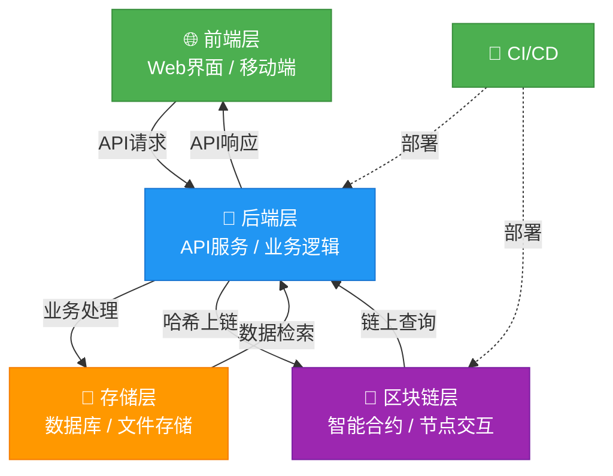
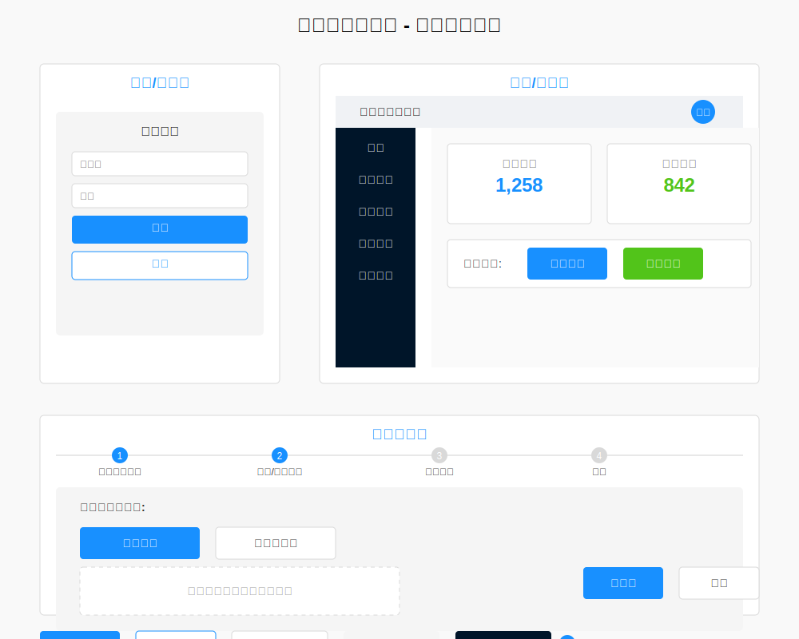

# 区块链存证系统 - 技术设计文档 (SDD)

## 1. 项目概述

### 1.1 项目背景

随着数字化进程的加速，电子数据的法律效力和真实性验证成为亟待解决的问题。区块链技术凭借其不可篡改、分布式账本特性，为电子数据存证提供了可靠的解决方案。

### 1.2 项目目标

开发一套基于区块链的存证系统，支持文件和文件哈希的存证、证明生成与验证功能，确保电子数据的真实性、完整性和不可否认性。

### 1.3 文档范围

本文档详细描述了区块链存证系统的技术实现方案，包括系统架构、模块设计、数据库设计、API 设计等内容。

## 2. 系统架构

### 2.1 总体架构

系统采用前后端分离架构，主要分为以下几层：



#### 2.1.1 前端层

- 采用 Next.js + React 框架开发
- 使用 Ant Design 组件库构建 UI 界面
- 使用 Axios 与后端 API 进行通信
- 使用 Web3.js 与区块链交互
- 使用 Redux 进行状态管理

前端页面布局设计如下：



#### 2.1.2 后端层

- 基于 Spring Boot 框架开发
- 采用 RESTful API 设计风格
- 使用 JWT 进行身份认证
- 集成 Web3.j 与区块链网络交互

#### 2.1.3 区块链层

- 支持以太坊公链和及其各种 EVM 兼容的区块链
- 智能合约实现存证逻辑
- 事件监听机制处理区块链交易确认

#### 2.1.4 存储层

- SqLite 数据库存储业务数据
- 本地文件系
- Redis 缓存热点数据

### 2.2 技术栈选择

| 类别     | 技术选型        | 选择理由                                                 |
| -------- | --------------- | -------------------------------------------------------- |
| 前端     | Next.js + React | 服务端渲染提升性能，组件化开发提高效率                   |
| 后端     | Spring Boot     | 成熟稳定，生态丰富，开发效率高                           |
| 数据库   | Sqlite          | 关系型数据库，适合结构化数据存储，轻量级不需启动任何服务 |
| 缓存     | Redis           | 高性能缓存，减轻数据库压力                               |
| 区块链   | 以太坊          | 以太坊生态成熟，联盟链适合企业应用                       |
| 存储     | 本地文件系统    | 本地存储成本低,可快速验证方案                            |

## 3. 模块设计

### 3.1 前端模块设计

#### 3.1.1 用户认证模块

- 登录/注册页面
- 身份验证与授权
- 用户会话管理

#### 3.1.2 仪表盘模块

- 系统概览统计
- 快捷操作入口
- 最近存证记录

#### 3.1.3 存证管理模块

- 存证列表与查询
- 存证创建向导
- 存证详情查看

#### 3.1.4 验证模块

- 多种验证方式支持
- 验证结果展示
- 验证报告生成

#### 3.1.5 个人中心模块

- 用户信息管理
- 账户设置
- 操作历史查看

### 3.2 后端模块设计

#### 3.2.1 用户管理模块

- 负责用户注册、登录、角色权限管理
- 实现 JWT 认证机制
- 提供用户信息管理功能

#### 3.2.2 存证管理模块

- 文件上传与哈希计算
- 区块链存证交易发起
- 存证记录管理
- 存证证明生成

#### 3.2.3 验证模块

- 文件哈希验证
- 区块链记录查询
- 验证报告生成

#### 3.2.4 系统管理模块

- 系统配置管理
- 日志管理
- 监控告警

## 4. 数据库设计

### 4.1 实体关系图


### 4.2 核心表结构

#### 4.2.1 用户表 (user)

```sql
CREATE TABLE user (
    id BIGINT PRIMARY KEY AUTO_INCREMENT,
    username VARCHAR(50) NOT NULL UNIQUE,
    password VARCHAR(100) NOT NULL,
    email VARCHAR(100) NOT NULL UNIQUE,
    role VARCHAR(20) NOT NULL,
    created_at DATETIME DEFAULT CURRENT_TIMESTAMP,
    updated_at DATETIME DEFAULT CURRENT_TIMESTAMP ON UPDATE CURRENT_TIMESTAMP
);
```

#### 4.2.2 存证记录表 (evidence)

```sql
CREATE TABLE evidence (
    evidence_id BIGINT PRIMARY KEY,
    user_id BIGINT NOT NULL,
    
    file_name VARCHAR(255) NOT NULL,
    file_size BIGINT NOT NULL,
    file_type VARCHAR(50) NOT NULL,
    file_path VARCHAR(255),
    hash_value VARCHAR(255) NOT NULL,
    hash_algorithm VARCHAR(20) NOT NULL,

    blockchain_id BIGINT NOT NULL,
    blockchain_tx_id VARCHAR(255),
    blockchain_block_height BIGINT NOT NULL,

    legalStatus VARCHAR(20) NOT NULL,
    created_at DATETIME DEFAULT CURRENT_TIMESTAMP,
    updated_at DATETIME DEFAULT CURRENT_TIMESTAMP ON UPDATE CURRENT_TIMESTAMP,
    FOREIGN KEY (user_id) REFERENCES user(id)
);
```

#### 4.2.3 存证证明表 (certificate)

```sql
CREATE TABLE certificate (
    id BIGINT PRIMARY KEY AUTO_INCREMENT,
    evidence_id BIGINT NOT NULL,
    certificate_number VARCHAR(100) NOT NULL UNIQUE,
    issued_date DATETIME NOT NULL,
    certificate_path VARCHAR(100) NOT NULL,
    FOREIGN KEY (evidence_id) REFERENCES evidence(id)
);
```

#### 4.2.4 验证记录表 (verification)

```sql
CREATE TABLE verification (
    id BIGINT PRIMARY KEY AUTO_INCREMENT,
    evidence_id BIGINT,
    hash_value VARCHAR(255),
    verifier_id BIGINT NOT NULL,
    verification_method VARCHAR(50) NOT NULL,
    result VARCHAR(20) NOT NULL,
    timestamp DATETIME NOT NULL,
    created_at DATETIME DEFAULT CURRENT_TIMESTAMP,
    FOREIGN KEY (evidence_id) REFERENCES evidence(id),
    FOREIGN KEY (verifier_id) REFERENCES user(id)
);
```

## 5. API 设计

### 5.1 用户管理 API

| 端点                | 方法 | 描述             | 请求体                        | 响应                            |
| ------------------- | ---- | ---------------- | ----------------------------- | ------------------------------- |
| /api/users/register | POST | 用户注册         | `{username, password, email}` | `{id, username, email, role}`   |
| /api/users/login    | POST | 用户登录         | `{username, password}`        | `{token, userInfo}`             |
| /api/users/me       | GET  | 获取当前用户信息 | -                             | `{id, username, email, role}`   |
| /api/users          | GET  | 获取用户列表     | -                             | `[{id, username, email, role}]` |

### 5.2 存证管理 API

| 端点                           | 方法 | 描述         | 请求体                                 | 响应                                                               |
| ------------------------------ | ---- | ------------ | -------------------------------------- | ------------------------------------------------------------------ |
| /api/evidence                  | POST | 创建存证     | `{file, hashAlgorithm}`                | `{id, file_name, hash_value, status}`                              |
| /api/evidence/hash             | POST | 哈希存证     | `{hashValue, hashAlgorithm, fileName}` | `{id, file_name, hash_value, status}`                              |
| /api/evidence                  | GET  | 获取存证列表 | -                                      | `[{id, file_name, hash_value, timestamp, status}]`                 |
| /api/evidence/{id}             | GET  | 获取存证详情 | -                                      | `{id, file_name, hash_value, blockchain_tx_id, timestamp, status}` |
| /api/evidence/{id}/certificate | GET  | 获取存证证明 | -                                      | `{certificate_number, blockchain_tx_id, signature, issued_date}`   |

### 5.3 验证 API

| 端点                    | 方法 | 描述         | 请求体                | 响应                                             |
| ----------------------- | ---- | ------------ | --------------------- | ------------------------------------------------ |
| /api/verify/file        | POST | 文件验证     | `{file}`              | `{result, message, evidence_info}`               |
| /api/verify/hash        | POST | 哈希验证     | `{hashValue}`         | `{result, message, evidence_info}`               |
| /api/verify/certificate | POST | 证明验证     | `{certificateNumber}` | `{result, message, certificate_info}`            |
| /api/verifications      | GET  | 获取验证记录 | -                     | `[{id, verification_method, result, timestamp}]` |

## 6. 安全设计

### 6.1 认证与授权

- 使用 JWT 进行身份认证
- 密码加密存储（BCrypt 算法）

### 6.2 数据安全

- 敏感数据传输采用 HTTPS
- 文件存储访问控制
- 数据库访问权限最小化

### 6.3 区块链安全

- 智能合约安全审计
- 私钥安全存储
- 交易签名验证

## 7. 部署设计

### 7.1 部署架构

- 前端部署在 CDN
- 后端服务部署在容器化环境
- 数据库采用主从架构
- 区块链节点根据需求部署

### 7.2 环境配置

| 环境     | 配置                 |
| -------- | -------------------- |
| 开发环境 | 本地 Docker 容器     |
| 测试环境 | 云服务器 Docker 集群 |
| 生产环境 | Kubernetes 集群      |

## 8. 性能优化

### 8.1 前端优化

- 代码分割
- 图片懒加载
- 资源缓存

### 8.2 后端优化

- 数据库索引优化
- 缓存策略
- 异步处理

### 8.3 区块链交互优化

- 交易批量处理
- 事件监听机制
- 区块链节点选择

## 9. 扩展性设计

### 9.1 模块扩展性

- 插件化设计
- 接口抽象

### 9.2 技术扩展性

- 支持多链集成
- 支持多种存储方案

## 10. 实施计划

### 10.1 阶段划分

- 阶段一：核心功能开发（4 周）
- 阶段二：测试与优化（2 周）
- 阶段三：部署与上线（1 周）

### 10.2 里程碑

- 完成用户管理模块
- 完成存证核心功能
- 完成区块链集成
- 系统测试通过
- 正式上线运行
